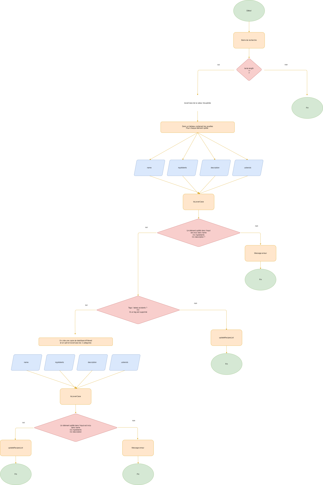
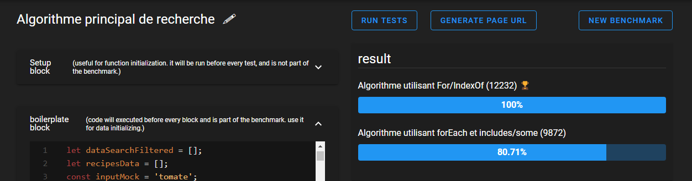

# Projet 7 - Les petits plats

Sixième projet de la formation OpenClassrooms : Développeur d'applications Javascript/React.
Objectif : 
- Récupération et mappage de données
- Analyser un problème
- Développer un algorithme de recherche
- Développer une alternative et comparer les performances des deux algorithmes développés

## Installation

Les librairies intégrées au projet sont : <br />
\- Font-Awesome <br />
\- Eslint <br /> <br />
Pour récupérer le projet, clonez directement ce repository puis faites un ``` npm install ```. <br />

## Demo


## Organigramme 

L'organigramme pour l'algorithme de recherche principale : <br />



## Performances

Un comparatif de performances pour l'algorithme de recherche principale utilisant des méthodes forEach, et des boucles For : <br />


